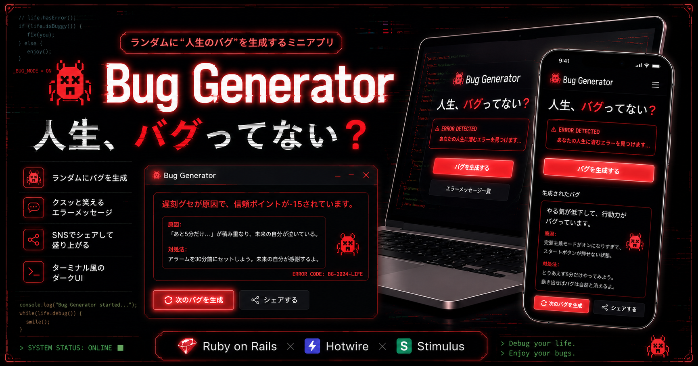

<div align="center">

# 🐞 Bug Generator

<p>人生、バグってない？ — エンジニアあるあるバグを生成してXでシェアするアプリ</p>



<br>

🔗 **[デモを見る](https://bug-generator-zt5t.onrender.com)**　|　📖 **[GitHubリポジトリ](https://github.com/mize1978/bug_generator)**

</div>

---

## 🖼️ スクリーンショット

**通常バグ**


**レアバグ（20%）**


---

## ✨ 機能
- バグ（エラー）をランダム表示（50種類以上・5カテゴリ）
- Turbo Frame でバグだけ差し替え（ページリロードなし）
- 「もう一回バグる」で再生成 / Space・Enter キーでも操作可
- 「今日◯回バグった」セッションカウンター
- クリップボードにコピー
- X（Twitter）シェア機能（テンプレートランダム）
- レアバグ（20%の確率）：💥 付きで金色にきらめく演出
- Web Audio API による操作音（外部ライブラリ・音声ファイル不使用）
  - ボタン押下：ピッ（矩形波）
  - 通常バグ表示：ポン（サイン波）
  - レアバグ出現：キラーン（C→E→G→C アルペジオ）
  - シェアボタン：カシャ（ホワイトノイズ）

---

## 🎯 こだわり

**設計面**
- バグメッセージを `BUGS` 定数（カテゴリ別ハッシュ）に切り出し、コントローラをシンプルに保った
- シェアテキスト生成・セッション管理はコントローラに集約し、ビューをロジックフリーに
- Turbo Frame を使いページ全体をリロードせずバグ部分だけ差し替え、SPA的なUXをRails標準機能で実現

**UX面**
- Web Audio API でボタンごとに異なるSEを生成（ピッ / ポン / キラーン / カシャ）
- レアバグ（20%）のみ演出を強化し、「当たった！」感を演出
- Stimulus でクリップボードコピーを実装

**インフラ面**
- 本番（Render）用と開発用でDockerfileを分離し、`docker compose up` 一発でローカル環境を再現

---

## 🛠 技術スタック
- Ruby 3.2 / Rails 7.2
- Turbo Frame（部分更新）
- Stimulus（クリップボードコピー）
- Importmap（JSバンドラー不使用）
- Web Audio API（サウンドエフェクト）
- Docker / Docker Compose
- SQLite
- HTML / CSS

---

## 🚀 セットアップ

```bash
git clone https://github.com/mize1978/bug_generator
cd bug_generator
docker compose build
docker compose up
```

http://localhost:3000 にアクセス

---

## 💡 制作を通じて学んだこと

シンプルなアプリだからこそ、「どこに何を書くか」を丁寧に考える練習になりました。

最初はロジックをビューに書いていましたが、テストしにくく読みにくいことに気づき、コントローラへ移動。
バグメッセージも最初はメソッド内にベタ書きでしたが、定数として切り出すことでテストが書けるようになり、
「動くだけのコード」から「意図が伝わるコード」への意識が変わりました。

また、Turbo Frame は「どこまでをフレームに含めるか」の設計判断が意外と難しく、
セッションカウンターをフレーム内に入れるかどうかで試行錯誤しました。
このような小さな判断の積み重ねが、実際の開発で活きると感じています。
